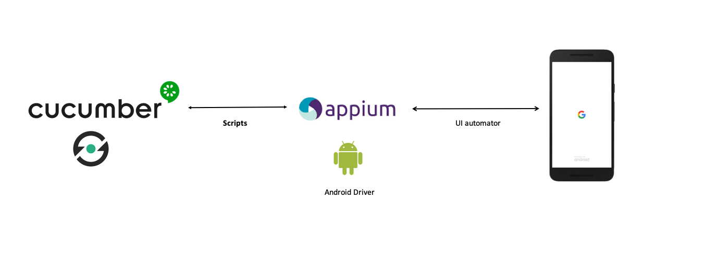

Scenarios contained in feature files written in Gherkin language.
Available scenarios can be found
[here](src/test/resources/io/cucumber).

Defined for the [ownCloud Android app](https://github.com/owncloud/android)

## Global overview

- Scenarios are defined with [Gherkin
Syntax](https://cucumber.io/docs/gherkin/).

- Steps are interpreted by [Cucumber](https://cucumber.io/).

- Step implementation language:
[Java](https://docs.oracle.com/javase/7/docs/)

- Device interaction with [Appium](http://appium.io/)

- Reports generated with [Cucumber Reports](https://reports.cucumber.io/)

## Get the code

- With git:

`git clone https://github.com/owncloud/android-scenario-testing.git`

- Download a [zip
file](https://github.com/owncloud/android-scenario-testing/archive/master.zip)

## Requirements

Different requirements:

* `Appium` instance running and reachable. Check this [link](https://appium.io/docs/en/about-appium/getting-started/?lang=en) to get futher info about Appium. 

* At least, one device/emulator attached and reachable via adb. Check command
`adb devices` to ensure `Appium` will get the device reference to
interact with it.

* The environment variable `$ANDROID_HOME` needs to be correctly set up,
pointing to the Android SDK folder

## How to test

### 1. Build app

First, build the [app](https://github.com/owncloud/android) from the expected branch/commit to get the test object.

The [buildAPK](https://github.com/owncloud/android-scenario-testing/blob/master/buildapk/buildAPK.sh) script will build the app by using the qa variant available in the app. Such variant:

- will disable welcome wizard
- will disable the release notes
- will set basic auth as forced authentication method, required to execute the test suites

Besides of that, the script also:

- builds a release-signed apk with the given keystore path and pass (check script variables)
- moves the final artifact to the correct place (`/src/test/resources` folder in the current structure)

As commented, check the script's variables for the proper setup in your own environment or CI system.

In the current repository there will be always an `owncloud.apk` file located in `/src/test/resources`, as example or fallback.

### 2. Execute tests

The script `executeTests` will launch the tests. The following environment variables must be set in advance

		$OC_SERVER_URL (mandatory): URL of ownCloud server to test against
		$APPIUM_URL (optional): Appium server URL.
			If Appium Server is not specified, will be used "localhost:4723"
		$UDID_DEVICE (optional): ID of the device/simulator to execute the tests onto.
			This ID could be get by executing  `adb devices`
		$BACKEND (optional): oCIS or oC10. If not specified, will be used oCIS.

The script needs some parameters. Check help `executeTests -h`

To execute all tests but the ignored ones (or any other tagged ones):

		export UDID_DEVICE=emulator-5554
		export OC_SERVER_URL=https://my.owncloud.server
		export APPIUM_URL=localhost:4723
		export BACKEND=oCIS
		./executeTests -t "not @ignore"

The execution will display step by step how the scenario is being executed.

** the `not @ignore` option is set by default

More info in [Cucumber reference](https://cucumber.io/docs/cucumber/api/)

**NOTE**: Since there are two kinds of backends available (oC10, oCIS), not all tests are suitable to be executed over both. Those tests have been tagged with:

- `@nooc10`: tests to be executed only over oCIS, not suitable for oC10.
- `@noocis`: tests to be executed only over oC10, not suitable for oCIS.

It's important to execute the tests with the mentioned tags to avoid wrong positives. Example commands:

`./executeTests -t "not @ignore and not @noocis"` 
This command will execute tests that are not ignored and suitable for oCIS. If this command is run over an oC10 instance, some tests will fail.

`./executeTests -t "not @ignore and not @nooc10"` 
This command will execute tests that are not ignored and suitable for oC10. If this command is run over an oCIS instance, some tests will fail.

Every [feature file](https://github.com/owncloud/android-scenario-testing/tree/master/src/test/resources/io/cucumber), and every rule inside every feature file is also tagged, for isolated execution just in case. 

## Results

In the folder `target`, you will find a report with the execution results in html and json formats.

Besides of that, by setting the `cucumber.properties` file, a nicer final report is integrated with [Cucumber reports](https://cucumber.io/docs/cucumber/reporting/?lang=java). An account in such platform (integrated with GitHub) is enough to use it. A new env variable must be set in advance in order to send reports to the platform. Token is provided in the Cucumber Reports account for every collection:

	export CUCUMBER_PUBLISH_TOKEN=d97...

Also, add in `cucumber.properties` file the following key-values (disabled by default):

	cucumber.publish.quiet=false
	cucumber.publish.enabled=true

## Versioning

Up to date: 07/May/2025

||        |
|:-- |:------:|
| [Cucumber version](https://cucumber.io/docs/installation/java/) | 7.21.1 |
| [Appium version](https://github.com/appium/appium/releases)| 2.18.0 |
| [Appium uiautomator2 driver version](https://github.com/appium/appium-uiautomator2-driver/releases)|  4.2.3  |
| [Java client version](https://github.com/appium/java-client/releases) | 9.4.0  |

**Note**: This repository was forked from [Cucumber-java
skeleton](https://github.com/cucumber/cucumber-java-skeleton)
repository, which contains the base skeleton to start working.
