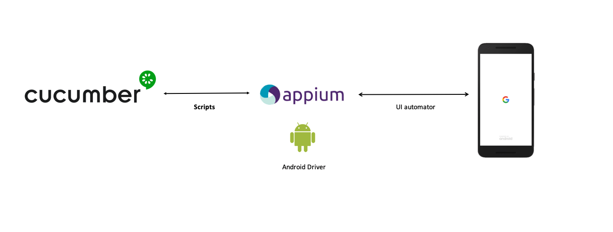

<!--Build status:
-->

Scenarios contained in feature files written in Gherkin language.
Available scenarios can be found
[here](src/test/resources/io/cucumber).

Defined for the [ownCloud Android app](https://github.com/owncloud/android)

## Global architecture

- Scenarios are defined with [Gherkin
Syntax](https://cucumber.io/docs/gherkin/).

- Steps are interpreted by [Cucumber](https://cucumber.io/).

- Step implementation language:
[Java](https://docs.oracle.com/javase/7/docs/)

- Device interaction with [Appium](http://appium.io/)

- Reports generated with [Cucumber Reports](https://reports.cucumber.io/)

## Get the code

- With git:

`git clone https://github.com/owncloud/android-scenario-testing.git`

- Download a [zip
file](https://github.com/owncloud/android-scenario-testing/archive/master.zip)

## Requirements

Different requirements:

* `Appium` instance running and reachable

* At least, one device attached and reachable via adb. Check command
`adb devices` to ensure `Appium` will get the device reference to
interact with it

The environment variable `$ANDROID_HOME` needs to be correctly set up,
pointing to the Android SDK folder

## How to test

The script `executeTests` will launch the tests. The following environment variables must be set in advance

		$OC_SERVER_URL (mandatory): URL of ownCloud server to test against
		$APPIUM_URL (optional): Appium server URL.
			If Appium Server is not specified, will be used "localhost:4723/wd/hub"

The script needs some parameters:

     -t (optional): Used to execute tagged tests. F. ex: @createfolder will send only tests tagged with such label. OR/AND operations are allowed. It is also allowed to use a classpath to execute all the test in such class

	Examples:

		 ./executeTests -t "@createfolder" -> This will execute only tests with the tag @createfolder

		 ./executeTests -t "'@createfolder and @copy'" -> This will execute tests tagged with both @createfolder and @copy

		 ./executeTests -t "'@createfolder or @copy'" -> This will execute tests tagged with @createfolder or @copy

		 ./executeTests  -> This will execute all the tests

	 -h: display the help

The execution will display step by step how the scenario is being executed.

More info in [Cucumber reference](https://cucumber.io/docs/cucumber/api/)

## Results

In the folder `target`, you will find a report with the execution results

**Note**: This repository was forked from [Cucumber-java
skeleton](https://github.com/cucumber/cucumber-java-skeleton)
repository, which contains the base skeleton to start working.