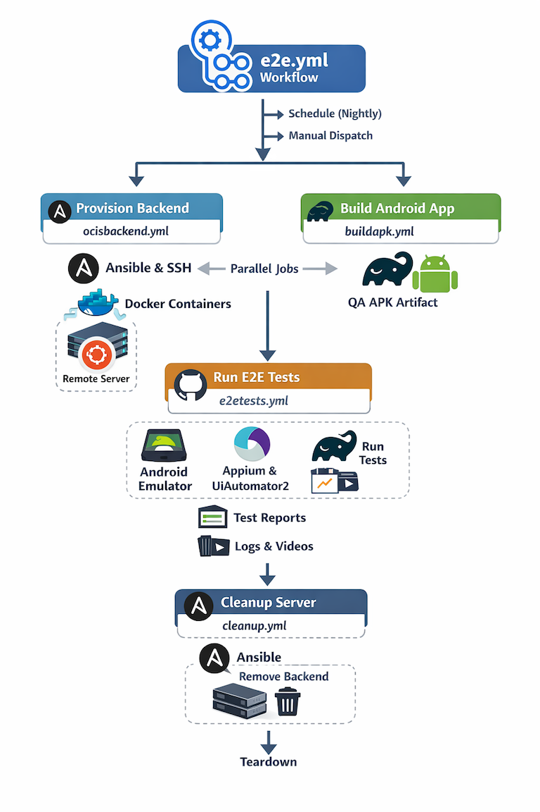

# Backend setup

In order to run the tests correctly, an instance of the server must be reachable. You can use an existing instance or create a new one via docker (recommended).

## 1. oCIS

### 1.1 Manual build

Follow these steps to build an oCIS backend by yourself:

1. Download and install `docker-compose` in your local, if you didn't
2. Download the current folder to your local machine
3. Export a variable `OCIS_PWD` with the admin password that will be set on your server, for example `export OCIS_PWD=myunsafepass`
4. Run the `create_server.sh` script with two parameters:
    - URL where the server will run
    - [oCIS version to deploy](https://hub.docker.com/r/owncloud/ocis/tags)

    for example `./create_server.sh https://192.168.1.49:9200 7.3.1`

The script will create an oCIS server over the given version. Also, it will create three users (`Alice`, `Bob`, `Charles`), and one group (`test`). `Alice` will become `Admin` and the other users just `User`. `Bob` will be added to the `test` group. That's the required setup for the E2E tests to run as expected.

Once backend is running, follow instructions to execute tests in the main [README](../README.md)

### 1.2 CI run

To run in GitHub Actons with the following architecture:


## 2. oC10

Script `create_oC10.sh` will create a server some users that are defined in the feature files (`Alice`, `Bob`, `Charles`) as well as a group called `test`.

Script requires three parameters

- `host`: hostname or IP where the server runs.
- `port`: port where server is listening.
- `version`: ownCloud version to create the container. Use [one of the available tags](https://hub.docker.com/r/owncloud/server/tags). 

For example:

```
./create_oC10.sh 192.168.1.10 8500 10.15.3
```

```
./create_oC10.sh myserver.com 12000 latest
```
